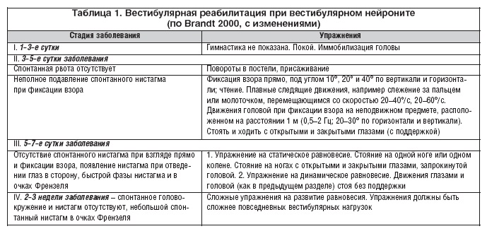

# Инструкция для работы с Markdown

## Выделение текста

Чтобы выделить текст курсивом, необходимо обрамить его звездочками (*). Например, *вот так*

Чтобы выделить текст полужирным, необходимо обрамить его двойными звёздочками (**). Например, **вот так** 

## Списки

Чтобы выделить ненумерованный список, используйте (*)

## Работа с изображениями

Чтобы вставить изображение в текст, достаточно написать следующее: 

## Работа с таблицами

## Цитаты

> Dorothy followed her through many of the beautiful rooms in her castle.

## Заключение